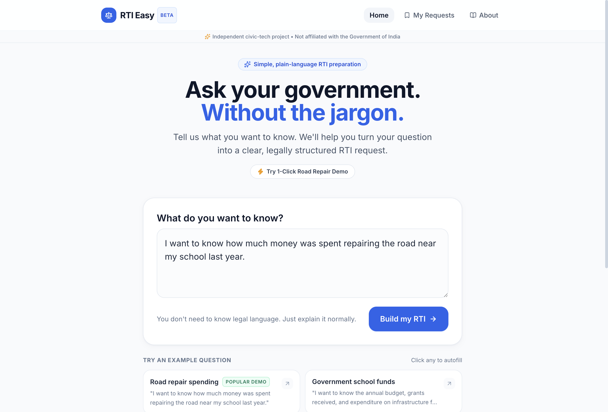
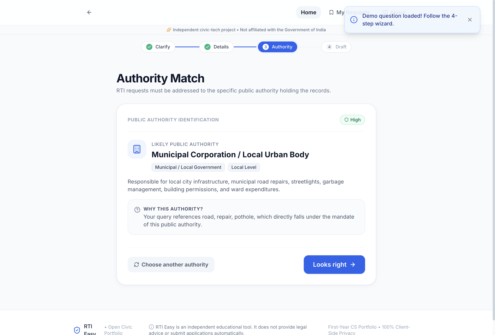
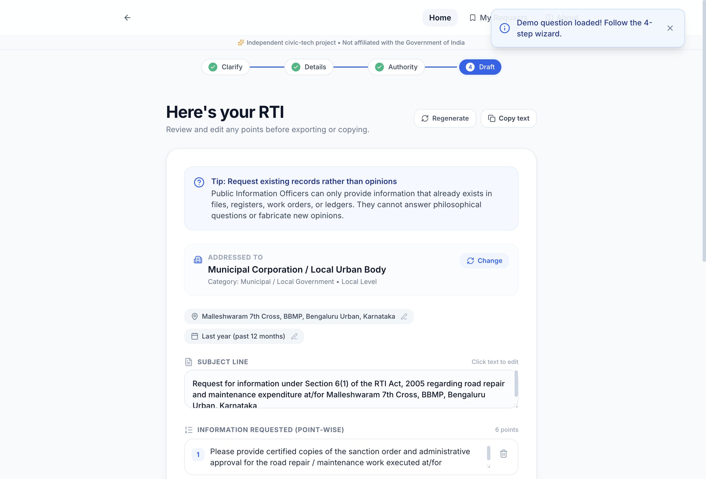
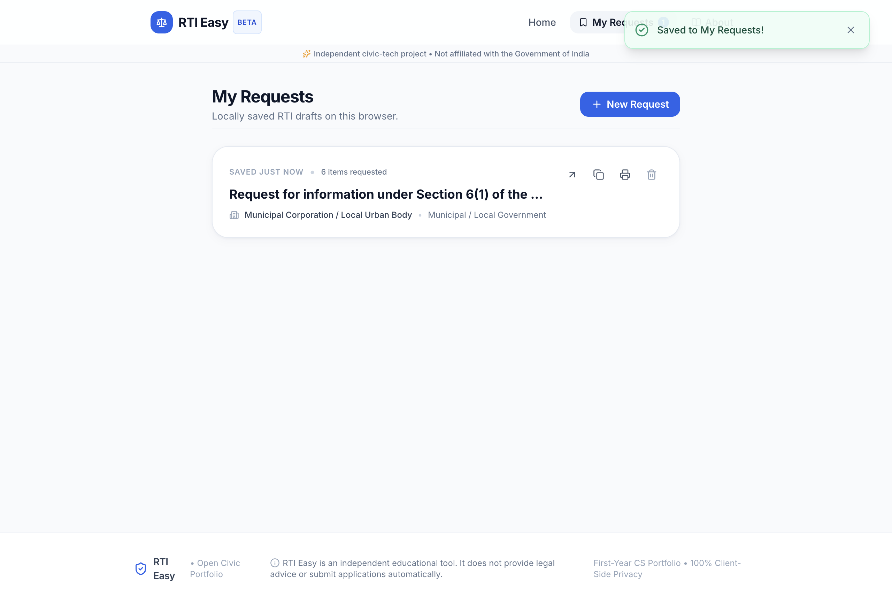

# RTI Easy ⚖️

> **"Ask your government. Without the jargon."**

An independent, educational civic-tech web application that empowers citizens to translate ordinary, everyday questions into clear, structured, and legally actionable Right to Information (RTI) requests.

Built as a first-year computer science portfolio project demonstrating modern React & TypeScript development, accessible mobile-first UX design, modular service abstractions, and client-side privacy architecture.

---

## 🏛️ Product Positioning & Civic Disclaimer

> [!IMPORTANT]
> **RTI Easy is an independent educational civic-tech project and is NOT affiliated with the Government of India or any state government department.**
>
> - RTI Easy does **not** submit RTIs automatically.
> - It does **not** collect government fees.
> - It does **not** fabricate government officers, Public Information Officer (PIO) names, official URLs, fees, application numbers, or fake tracking numbers.
> - If official information or online submission portals are unavailable, the application transparently advises citizens to verify directly with local authorities.

---

## 🎯 The Problem

The Right to Information (RTI) Act, 2005 is one of India's strongest citizen empowerment laws. However, first-time applicants face significant hurdles:
1. **Legalistic Intimidation**: Citizens believe they must know formal legal phrases (e.g., Section citations, gazette references).
2. **Jurisdiction Confusion**: Citizens often don't know whether a road, school, or streetlight is managed by a Municipal Corporation, State PWD, District Collectorate, or Central Ministry.
3. **Asking for Opinions instead of Records**: Citizens frequently ask questions like *"Why did the road break?"*—which public officers can reject under Section 2(f)—instead of requesting *certified copies of the work order, sanctioned expenditure, and defect liability reports*.

---

## 💡 The Solution

RTI Easy turns this experience into a guided consumer-friendly workflow:

```
Describe ──▶ Clarify ──▶ Find Authority ──▶ Draft RTI ──▶ Review & Edit ──▶ Export (Print / PDF)
```

1. **Describe**: Type what you want to know in ordinary language (e.g., *"I want to know how much money was spent repairing the road near my school last year"*).
2. **Clarify**: Answer 1–3 non-intrusive questions that hone the scope without collecting unnecessary personal data.
3. **Find Authority**: The system matches the query to the likely public authority (with confidence scores and clear neutral reasoning).
4. **Draft RTI**: Generates a point-wise request asking strictly for existing records, sanction orders, work agreements, and inspection registers.
5. **Review & Edit**: Full inline editing for subject, individual points, authority, and location context.
6. **Export**: One-click print-ready standard Section 6(1) document ("Print → Save as PDF") or formal text copy, accompanied by official verified submission guidance.

---

## ✨ Features

- **Natural-Language Input**: Type your question naturally or click one of the interactive real-world examples.
- **Contextual Clarifications**: Generates 1–3 targeted questions tailored to whether the topic is roads, schools, streetlights, police, water, or general public spending.
- **Public Authority Engine**: Categorizes requests into Municipal, PWD/Roads, Education, Police, Revenue, Transport, Electricity, Water, Public Health, Rural Development, State, and Central Government.
- **Pluggable AI Abstraction**: Clean service architecture (`AIService`) with a high-fidelity offline mock implementation and immediate extensibility for LLM APIs (Gemini/OpenAI).
- **Inline Document Editor**: Edit the subject line, reword specific points, add or remove points with a single click.
- **Print & PDF Export**: Pre-styled Section 6(1) RTI Application layout ready for browser *Print / Save as PDF*.
- **100% Client-Side Privacy**: Persists active drafts, saved requests ("My Requests"), and applicant details solely in `localStorage`. Zero telemetry, zero external trackers.
- **Mobile-First UX**: Responsive touch targets, comfortable keyboard navigation, and sticky action bars optimized for 360px–412px viewports up to large desktop monitors.

---

## 🛠️ Tech Stack

- **Core**: [React 19](https://react.dev/), [TypeScript](https://www.typescriptlang.org/)
- **Build Tool**: [Vite 8](https://vitejs.dev/)
- **Styling**: [Tailwind CSS v3](https://tailwindcss.com/)
- **Icons**: [Lucide React](https://lucide.dev/)
- **Storage**: Browser `localStorage` with error-resilient serialization
- **Deployment**: Static build output (`npm run build` -> `dist/`)

---

## 📁 Architecture & Folder Structure

```
rti-easy/
├── public/
├── src/
│   ├── components/
│   │   ├── common/             # Toast, Modal, LoadingState, EmptyState, ProgressIndicator
│   │   ├── document/           # RTIDocument, EditableRTIDocument, PrintableRTI
│   │   ├── export/             # ExportButton, ExportModal, SubmissionGuide
│   │   ├── layout/             # AppShell, TopBar, Footer
│   │   ├── saved/              # SavedRequestsList, SavedRequestCard
│   │   └── wizard/             # Step0Describe, Step1Clarify, Step2Details, Step3Authority, Step4Review
│   ├── data/
│   │   ├── authorities.ts      # Categorized public authorities, keywords, and verified portal references
│   │   ├── sampleQuestions.ts  # Pre-configured demo scenarios for one-click testing
│   │   └── statesAndDistricts.ts # Indian states and districts reference
│   ├── pages/
│   │   ├── HomePage.tsx        # Wizard state machine and auto-save coordinator
│   │   ├── AboutPage.tsx       # Civic mission, principles, and disclaimers
│   │   └── SavedRequestsPage.tsx # Standalone manager for locally saved requests
│   ├── services/
│   │   ├── ai/                 # AIService interface, MockAIService engine, and index factory
│   │   ├── authority/          # Authority matching algorithms and category filter
│   │   ├── export/             # Plaintext generator, clipboard copy, and print handler
│   │   └── storage/            # LocalStorage persistence manager
│   ├── types/
│   │   └── rti.ts              # Strongly typed models (RTIDraft, Authority, Applicant, etc.)
│   ├── utils/
│   │   └── formatters.ts       # Date and label formatting helpers
│   ├── App.tsx                 # Root application component
│   ├── index.css               # Tailwind directives and @media print styling
│   └── main.tsx                # React DOM entry point
├── package.json
├── tsconfig.json
├── tailwind.config.js
└── vite.config.ts
```

---

## 🚀 Getting Started

### Prerequisites

- [Node.js](https://nodejs.org/) (v18.0.0 or higher)
- npm (v9.0.0 or higher)

### Installation

```bash
# Clone the repository
git clone https://github.com/your-username/rti-easy.git

# Navigate to project folder
cd rti-easy

# Install dependencies
npm install

# Start local development server
npm run dev
```

Visit `http://localhost:5173` in your browser.

### Building for Production

```bash
npm run build
```

The production assets will be built to the `dist/` directory.

---

## 📸 Screenshots

### 1. Plain-Language Question Input

*Landing screen featuring ordinary-language prompt, quick-start sample scenarios, and 1-click demo.*

### 2. Contextual Clarification Wizard

*Guided clarification cards that hone request scope without requesting intrusive personal details.*

### 3. Public Authority Matching & Rationale

*Automatic public authority identification with confidence rating and transparent jurisdictional reasoning.*

### 4. Structured Point-Wise RTI Draft & Inline Editor

*Point-wise legal record request focusing strictly on existing ledgers, work orders, and inspection reports.*

### 5. Local Draft Management ("My Requests")

*100% private client-side storage to review, copy, export, and manage saved RTI drafts.*

---

## 🧪 Testing the Core Experience

1. **Launch App**: Open the home screen.
2. **Run Demo**: Click the **"Try 1-Click Road Repair Demo"** button or enter any plain question.
3. **Clarify**: Select the type of repair (e.g. *Complete tarring / Re-surfacing*) and click **Continue**.
4. **Details**: Select state and district. Notice how **"I don't know"** is supported for the department. Click **Find the authority**.
5. **Authority Match**: View the matched **Municipal Corporation / Local Urban Body** with confidence badge and reason. Click **Looks right**.
6. **Generated RTI**: Review the numbered record requests (sanctions, tender work orders, quality inspection reports, defect liability period).
7. **Edit**: Edit any point or click **Add another point**.
8. **Export**: Click **Export RTI**, enter applicant details, and test **Print or Save as PDF** or **Copy Formal Text**.
9. **Persistence**: Refresh the page—your draft is restored from `localStorage`.
10. **Saved Requests**: Click **Save draft** and inspect **My Requests**.

---

## 🔮 Future Roadmap

- [ ] **Verified Authority Directory**: Searchable registry covering all 4,000+ Indian Urban Local Bodies (ULBs) and Panchayati Raj Institutions.
- [ ] **Multilingual Support**: Hindi, Kannada, Tamil, Marathi, Bengali, and Telugu translations.
- [ ] **Live AI Integration**: Optional toggle to connect direct Gemini 1.5 Pro / Flash API keys for advanced conversational refinement.
- [ ] **Postal Tracking Companion**: Citizen-entered registered speed post tracking reminders.

---

## 📄 License

Distributed under the MIT License. See `LICENSE` for more information.

*RTI Easy is created for educational and portfolio demonstration purposes.*
